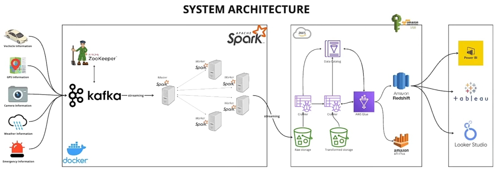

## Smart City Streaming data End-to-End Data Engineering/ETL project on AWS.
(Kafka, Spark, Python, AWS S3, Glue, Redshift Serverless, Athena, Docker, DBeaver, Zookeeper)

The Aim of this project is to build a Realtime ETL streaming pipeline which processes realtime data from a smart city using Kafka, used spark to Transform the data, saves the data to an S3 bucket.
We then used Glue crawler to crawl the S3 bucket and make the data available in Glue Data Catalog tables and then made the data available to Redshift data warehouse using external schema(Redshift spectrum), to enable the data to be easily visaulized by end users or Data Analyst using PowerBI or any other BI tool

### Below is the System Architecture diagram

The tools used includes:
1. Apache Kafka for streaming the data
2. Spark for transforming the data
3. AWS S3 for storage
4. Glue Crawler for crawling the S3 bucket and making the data available in Glue Data Catalog tables
5. Amazon Redshift Serverless for data warehouse
6. Athena for querying the dat
7. Docker compose was used to manage different containers (Kafka broker and Zookeeper)

